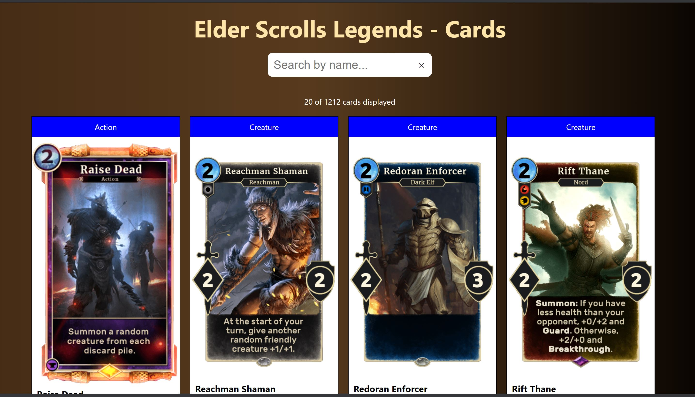

# HighSpot Coding Exercise - ElderScroll Cards Viewer

The ElderScroll Cards Viewer is a web application to view and find ElderScroll Legends cards. It is based on the Elder Scrolls Legends API, a free third-party service built by an independent developer; it is not affiliated with the owner of this repository, or with the intellectual property owners of Elder Scrolls Legends.

This project was bootstrapped with [Create React App](https://github.com/facebook/create-react-app).

## Table of contents

-   [Technologies](#technologies)
-   [Setup](#setup)
-   [Screenshots](#screenshots)
-   [Features](#features)
-   [Production](#production)
-   [To Do](#todo)
-   [Contact](#contact)

## Technologies

-   [Node.js v12.3.1](https://nodejs.org/) javascript runtime using the [Chrome V8 engine](https://v8.dev/)

-   [React v16.13.1](https://reactjs.org/) Frontend javascript library.

-   [Jest](https://https://jestjs.io/)

-   [React Hooks](https://reactjs.org/docs/hooks-overview.html#state-hook)

## Setup

-   Clone this repository and navigate to the root of the repo

*   `npm install`

> Installs all dependencies required by the application

-   `npm start` the application

> Runs the frontend in development mode. It will open [http://localhost:3000](http://localhost:3000) to view in browser. Any code changes will automatically reload the browser.

-   `npm test`

> Launches the test runner in the interactive watch mode. 
> See the section about [running tests](https://facebook.github.io/create-react-app/docs/running-tests) for more information.

## Screenshots

.

## Features

-   Displays 20 Elder Scroll cards at a time

-   Loads more cards in batches of 20 using infinite scroll

-   Allows searching for cards by name

-   Displays details about each card including Name, Type, Image etc.

In the project directory, you can run:

## Production

-   `npm run build`

> Builds the app for production to the `build` folder. 
> It correctly bundles React in production mode and optimizes the build for the best performance.

> The build is minified and the filenames include the hashes. 
> Your app is ready to be deployed!

See the section about [deployment](https://facebook.github.io/create-react-app/docs/deployment) for more information.

## To Do

-   More unit tests to cover core scenarios

-   Error pages to handle UI when errors occur

*   Address accessibility shortcomings of components e.g aria tags on images

*   Add overlay to page while new items are being added during infinite scroll

*   Add paging or infinite scrolling to search results

*   Default image if card image is missing

## Contact

Please reach out via github.
